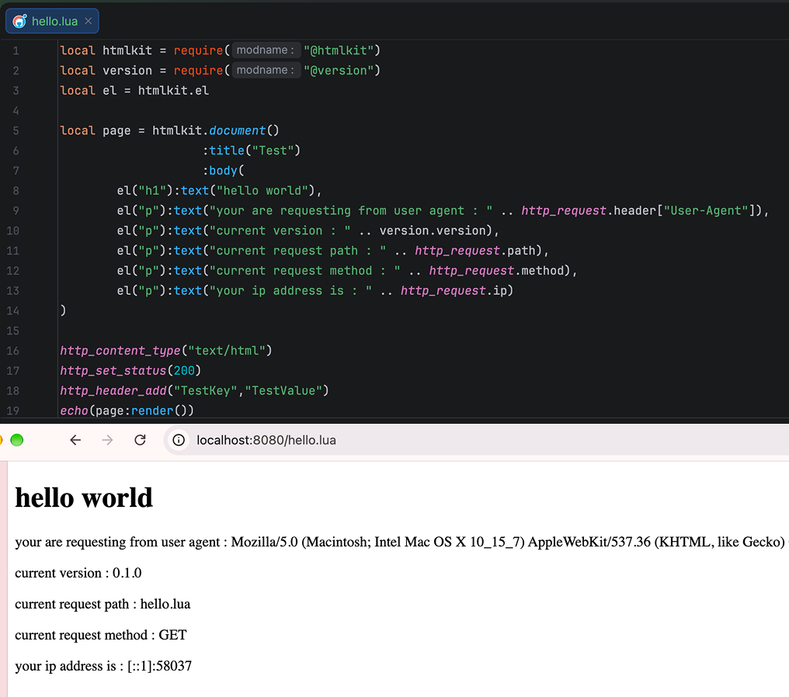

# zolt



a tiny zig web server that speaks your language. you write your pages in luau and zolt runs them for you and return it to your user. no build step, no framework, no fuss.

# Get Started

getting zolt running is really easy terminal is all you need.

```bash
curl -fsSL https://zolt-doc.perr.dev/asset/install-zolt.sh | bash
```

after that restart your shell (or run `source ~/.zshrc` / `source ~/.bashrc`)

make an app folder

```bash
mkdir myapp
cd myapp
```

create `config.luau` with this content

```luau
return {
    host = "127.0.0.1:8080",
}
```

write your first page

create `index.luau` with this content

```luau
echo("Hello, world!");
```

now run `zoltd` along with path to your `config.luau` file

after that visit http://127.0.0.1:8080 in your browser. hello, world! welcome to zolt

# Documentation

Refer to here for more info about api reference [here!](https://zolt-doc.perr.dev/)

# Built-in modules

`zoltd` ships a small standard library of Luau modules. Any route script can load one from any folder depth with an `@` require:

```luau
local version = require("@std/version");
echo(version.name .. "/" .. version.version);
```

Each `@name` maps to a file inside the embedded `std_lib/` folder (`@std/version` is `std_lib/std/version.luau`). Requiring a built-in that does not exist raises a `require` error and never falls back to your app's files.

# Build from source

want to build it yourself? you'll need zig 0.16.0. the first build downloads luau automatically, so it needs internet just that once:

```bash
git clone https://github.com/iluvicecream/zolt
cd zolt
zig build
```

when it finishes, you'll have the server at `zig-out/bin/zoltd`.

# How it works

every request the server try to find a .luau file at that path if it doesn't file it try to serve the request as static file but if it does found a .luau it will create a lua vm and run it return the response to client

# Credits

- [Luau](https://luau.org/)
- [Grug Hand Font](https://handdrawn.software/grug/)
